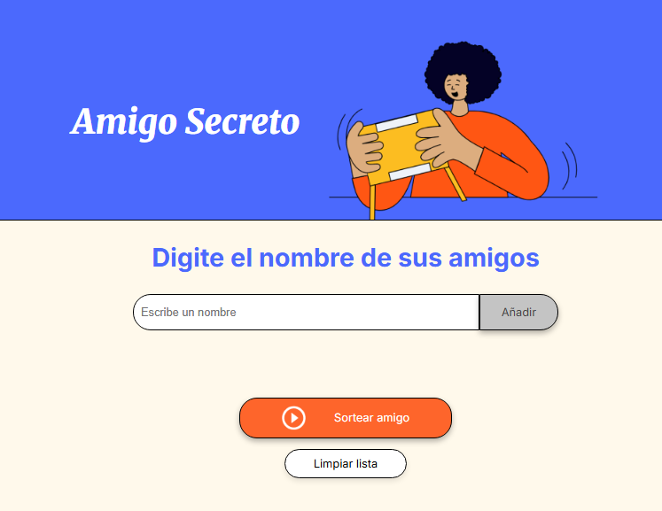
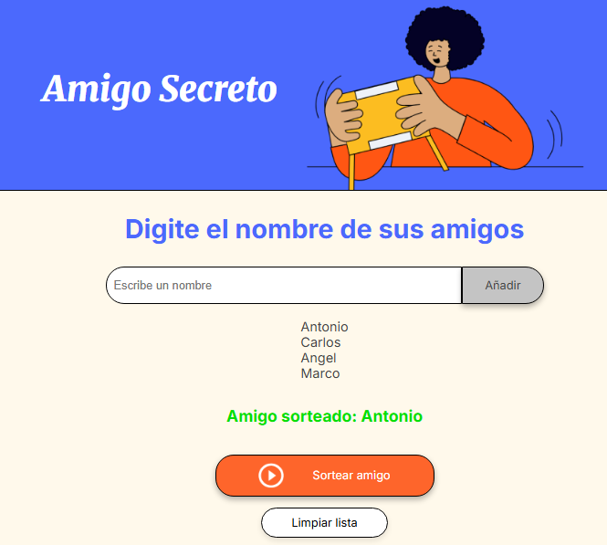

# 🎁 Proyecto Amigo Secreto

Este es un proyecto sencillo para organizar un **sorteo de Amigo Secreto** desde el navegador.  
Permite:

- ➕ Agregar nombres de participantes.  
- 📋 Mostrar la lista de participantes.  
- 🎲 Realizar un sorteo aleatorio.  
- 🗑️ Limpiar la lista cuando quieras.  

---

## 🚀 Cómo ejecutar el proyecto

1. Clona este repositorio o descárgalo en tu computadora.  
2. Abre la carpeta en **Visual Studio Code**.  
3. Instala la extensión **Live Server**.  
4. Haz clic derecho en `index.html` → *"Open with Live Server"*.  
5. ¡Listo! El proyecto se abrirá en tu navegador.  

---

## 📸 Capturas de pantalla

### Pantalla principal

### Botón de sorteo

---

## 🛠️ Tecnologías usadas

- 🟠 **HTML5**  
- 🔵 **CSS3**  
- 🟡 **JavaScript**  

---

## ✨ Autor

📌 Proyecto creado por **Euler Rivas Ramos**  
💻 Apasionado por la tecnología y el aprendizaje constante.  

---
